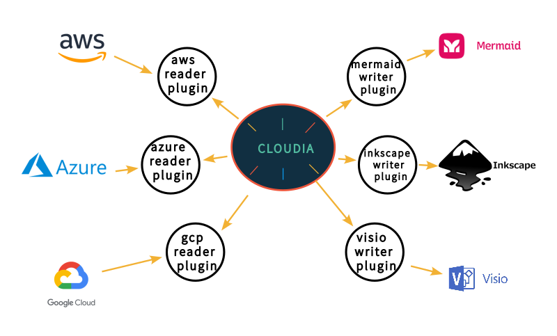

# Cloudia Core

Cloud Infrastructure Abstraction. Cloudia reads clouds and will write diagrams.

**WARNING WIP** application and documentation will change.

## Development

Clone this project and run `nix develop`.

To start your Phoenix server:

* Run `mix setup` to install and setup dependencies
* Start Phoenix endpoint with `mix phx.server` or inside IEx with `iex -S mix phx.server`

Now you can visit [`localhost:4000`](http://localhost:4000) from your browser.
